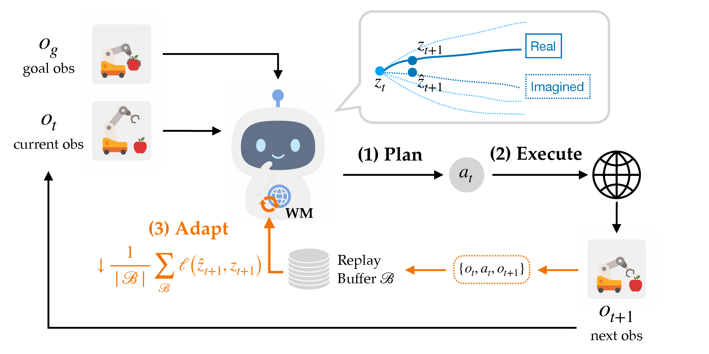
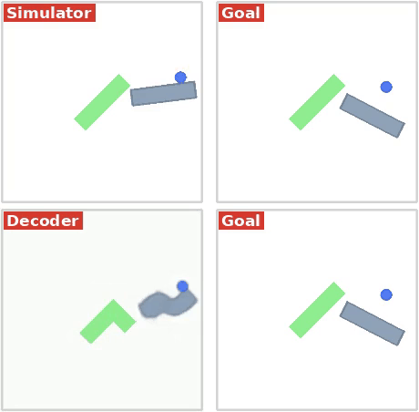

# MnemoLoRA: Fast Episodic Plasticity, Persistent Continual Memory

**Learn fast within an episode. Remember safely across episodes. Consolidate with linear algebra—not distillation.**

> **Research preview.** MnemoLoRA is implemented through the FD-PSC protocol and has passed offline protocol tests and lightweight CUDA smoke tests. End-to-end evaluation with released AdaJEPA checkpoints, real MPC rollouts, multi-seed experiments, and formal performance/memory benchmarks is still in progress. The implementation and default settings will be revised in response to those GPU results.

## Overview

Continually adapting a world model creates a stability–plasticity dilemma. If the model remains frozen, it cannot correct prediction errors under new visual conditions, layouts, dynamics, or task contexts. If it is fine-tuned continuously, new experience can overwrite previously useful behavior: the model learns the current episode but catastrophically forgets what earlier episodes taught it. Making retention constraints too strong creates the opposite failure—the model remembers, but loses the ability to keep learning.

[MnemoLoRA](#technical-method) is a lightweight continual-memory layer for [AdaJEPA](https://arxiv.org/abs/2606.32026). It separates learning into two timescales. **Within an episode**, a fast episodic LoRA remains directly trainable from self-supervised transition errors, preserving AdaJEPA's convenient online update-and-replan loop. **Between episodes**, useful changes are converted into persistent low-rank memory through factor concatenation, thin QR, small-core SVD, subspace projection, spectral rescaling, and rank selection—without a teacher model, a separate distillation network, or offline retraining.

MnemoLoRA's implementation protocol is called **FD-PSC (Full-Depth Plasticity with Safe Consolidation)**. Its central objective is to prevent catastrophic forgetting while preserving future plasticity: keep the pretrained checkpoint immutable, let the fast adapter continue to learn during the current episode, and commit only algebraically consolidated memories that pass explicit retention, plasticity, functional-error, and spectral-drift checks.

<p align="center">
  &#151; <a href="https://agenticlearning.ai/adajepa/"><b>View Paper Website</b></a> &#151;
  <a href="https://arxiv.org/abs/2606.32026"><b>View Paper</b></a> &#151;
</p>



## Contents and Quick Start

1. [Installation](#installation)
2. [The Continual-Memory Problem](#the-continual-memory-problem)
3. [Technical Method](#technical-method)
4. [Current Validation Status](#current-validation-status)
5. [GPU Evaluation and Update Plan](#gpu-evaluation-and-update-plan)
6. [AdaJEPA](#adajepa)
7. [MnemoLoRA / FD-PSC Test-Time Memory](#mnemolora--fd-psc-test-time-memory)
8. [Released Checkpoints and Eval Data](#released-checkpoints-and-eval-data)
9. [Evaluation](#evaluation)

### Installation

```bash
git clone https://github.com/agentic-learning-ai-lab/adajepa.git
cd adajepa
conda env create -f environment.yaml
conda activate ts
```

The environment is identical to [temporal-straightening](https://github.com/agentic-learning-ai-lab/temporal-straightening)'s; see its README for details. MuJoCo is only needed for the maze environments; PushT/PushObj evaluation works without it.

## The Continual-Memory Problem

MnemoLoRA is designed around the two requirements that continual adaptation often treats as a trade-off: **do not forget old capabilities, and do not stop learning new ones**.

| Problem | Why it matters | MnemoLoRA mechanism |
|---|---|---|
| Catastrophic forgetting | Learning the current episode can overwrite knowledge acquired in earlier contexts | Frozen base weights, historical replay, anchor constraints, context-aware memory, and guarded commits |
| Loss of plasticity | Over-protecting old knowledge can make later episodes impossible to learn | A separate fast episodic LoRA remains trainable inside every episode; plasticity is checked before persistence |
| Short-lived adaptation | Resetting after every episode discards useful experience | Accepted episode knowledge is compressed into persistent slow or routed LoRA memory |
| Heavy consolidation | Distillation normally needs a teacher, extra training data, and additional optimization | Factor-space linear algebra—QR, small SVD, subspace projection, spectral rescaling, and rank compression |
| Distribution shift | Visual, geometric, or dynamics changes make latent predictions inaccurate | Self-supervised online updates from executed transitions |
| Conflicting contexts | One global adapter may be unsuitable for multiple modes of the environment | Context-routed exception adapters with local replay |
| Unsafe persistence | Calibration gain alone does not prove that an update is safe | Single-use commit-query evaluation, six commit gates, optional rollout canary, and rollback |
| Reproducibility and auditability | Online state can otherwise be difficult to inspect or recover | Immutable base weights, explicit state machine, atomic sidecar checkpoints, and commit journals |

MnemoLoRA is therefore a **continual-memory and update-control layer around AdaJEPA's original online adaptation loop**. It does not replace the planner, the JEPA prediction objective, or the pretrained world model. It changes where adaptation is stored, how it is consolidated, and what evidence is required before it is allowed to persist.

## Technical Method

MnemoLoRA separates fast plasticity from persistent memory instead of forcing one adapter to do both jobs:

| Timescale | State | Update mechanism | Purpose |
|---|---|---|---|
| Within an episode | Episodic LoRA | Ordinary lightweight gradient updates on self-supervised JEPA loss | React quickly to the current environment and keep learning after every replan |
| Between episodes | Slow LoRA or routed exception LoRA | Primarily factor-space linear algebra plus validation gates; no distillation | Retain reusable knowledge without rewriting the base model |
| Across the full lifetime | Frozen `theta_0` + bounded low-rank memories | Immutable base audit, replay, routing, checkpoints, and rollback | Limit forgetting while preserving room for later adaptation |

### 1. Closed-loop self-supervised adaptation

AdaJEPA alternates between planning, acting, observing, adapting, and replanning. For each valid observation/action window, it minimizes the same sliding one-step latent prediction loss used by the original adaptation path: predicted future latents are compared with stop-gradient target latents. No additional expert action labels are required at test time.

FD-PSC preserves the original MPC update schedule, replay-buffer semantics, prediction loss, optimizer type, and predictor/encoder learning-rate groups. The episodic adapter can still be updated at the original `finetune_every` cadence, including multiple real optimizer steps when configured; continual memory does not turn the fast path into a frozen or inference-only component. When FD-PSC is disabled, no adapters or hooks are injected and the original checkpoint/state-dict behavior remains unchanged.

### 2. Frozen base model and multi-timescale LoRA

The released AdaJEPA checkpoint is treated as an immutable base, denoted by `theta_0`. FD-PSC discovers active `Linear` layers in the predictor and active `Linear`/`Conv2d` layers in the post-backbone projection head. The frozen visual backbone is excluded. Grouped convolution targets are represented group-by-group, and the low-rank update is evaluated without materializing a dense convolution-kernel delta.

For a logical target layer, the effective parameters are composed from several low-rank memories:

```text
P_before    = theta_0 + Delta_slow + Delta_route
P_fast      = P_before + Delta_episode
P_candidate = theta_0 + Delta_proposed + Delta_route
```

- **Episodic LoRA** is the fast, temporary adapter trained throughout the current episode and reset or re-centered at an explicit lifecycle boundary.
- **Slow LoRA** stores updates that have passed consolidation and commit checks.
- **Routed exception LoRA** stores context-specific knowledge that should not be forced into the global slow adapter.
- **Base parameters and persistent buffers remain frozen and are audited bitwise.** Persistent FD-PSC state is written to a separate sidecar checkpoint rather than into the official AdaJEPA checkpoint.

This separation makes it possible to compare the frozen baseline, episode-only adaptation, naive accumulation, plain SVD consolidation, and the complete FD-PSC method under the same planner.

### 3. Conflict-aware fast adaptation and Triggered SLICE

FD-PSC collects exact effective-weight gradients for current, historical, and anchor objectives. It tracks cosine conflicts through exponential moving averages and can project a current gradient onto a feasible direction subject to history and anchor constraints. PCGrad-style correction is also supported as an explicit component.

When sustained conflict is detected, **Triggered Delayed SLICE** performs a one-time transition from the initial Pilot adapter to a Centered adapter. The initialization is derived from a low-rank decomposition of the corrected effective gradient and matched to the magnitude of a real first optimizer step. The switch does not create an extra training step, and the effective output is continuous at activation time.

### 4. Spectral drift control

The system records a compact spectral description of the frozen base layer and monitors how episodic or persistent updates interact with that subspace. Event-triggered SDC attenuates gradient components associated with unsafe spectral drift when drift and anchor-regression signals occur together.

During consolidation, **Spectral Surgery** searches over bounded singular-value rescaling of the episodic task vector. It generates candidate updates rather than mutating persistent state directly; a candidate that worsens the calibration objective or violates later constraints is rejected.

### 5. Distillation-free algebraic consolidation

After a successful planner episode with usable support data, FD-PSC enters a sleep phase. Its primary consolidation path does **not** train a student to imitate a teacher, generate distillation targets, or replay the full model through an additional offline training stage. Instead, it treats the episodic LoRA update as a low-rank task vector and builds candidate persistent memories directly in factor space.

Historical activations define a compact input subspace `Q/lambda`. **soft-NESS** uses this subspace to apply different merge coefficients to shared directions and safer residual directions. Existing and proposed LoRA factors are concatenated and recompressed with thin QR and a small-core SVD. Rank is selected from a configured set using both retained spectral energy and functional output error, subject to a hard maximum rank. Because these operations act on low-rank factors and small matrices, the consolidation mechanism is intended to remain substantially lighter than full-model retraining or teacher–student distillation.

The implementation also contains an explicit **optional bounded repair fallback** for cases where the algebraic quick candidate is infeasible. Repair can optimize current JEPA loss, replay loss, and a layerwise proximal-retention objective for a fixed small budget; its checkpoints are screened deterministically and it never becomes an unbounded training loop. GPU experiments will report the algebraic quick path and repair fallback separately, including how often repair is needed and whether its measured benefit justifies keeping it enabled by default.

### 6. Context-routed exception memory

Some shifts should not be merged into one global adapter. FD-PSC can route an episode by a frozen context descriptor to a bounded bank of exception adapters. Each exception stores a prototype, its own low-rank state, local replay, usage statistics, and an auditable replacement/eviction history.

An unmatched context normally uses the global slow adapter first. A new exception is considered only when global consolidation and repair fail while the episode still demonstrates valid calibration gain. Existing routed episodes update only their selected exception and do not duplicate that exception into global slow memory.

### 7. Guarded commit and transactional recovery

Candidate selection uses calibration data only. Once one final proposal has been frozen, FD-PSC permits exactly one access to a separate commit-query split. The proposal is checked for current-task gain retention, historical mean and worst-context regression, anchor regression, plasticity retention, layerwise functional error, and spectral drift. The commit query cannot be reused to search for a second proposal.

Accepted mutations to slow memory, exception memory, replay, activation subspaces, routing state, counters, and random-number-generator state occur inside one transaction. Any exception, failed gate, failed checkpoint write, or optional canary failure restores the previous consistent state. Versioned sidecar checkpoints and journals support auditable between-episode recovery while leaving `theta_0` untouched.

## Current Validation Status

The following table deliberately separates implementation evidence from scientific performance evidence:

| Validation item | Current status | Interpretation |
|---|---|---|
| Configuration, state machine, LoRA math, merge, rollback, and integration tests | `PASS` in the recorded offline test run | Evidence for software/protocol behavior on synthetic fixtures |
| Lightweight CUDA operator smoke and a complete CUDA toy episode | `PASS` on one RTX 4060 Laptop GPU | Evidence that the principal GPU paths execute; not a formal compatibility matrix |
| Released checkpoint loading and real target-layer enumeration | `UNRUN` | Actual target counts, dimensions, clipped ranks, and manifest hashes are not yet reported |
| Real PushT/PushObj/maze/diverse-maze MPC rollout | `UNRUN` | No MnemoLoRA planning success rate is claimed |
| Resettable Gate-7 canary | `UNRUN` | Requires an independent deterministic evaluator and manifest |
| Multi-GPU and BF16/FP16/FP32 consistency | `UNRUN` | Numerical tolerances and hardware coverage remain to be established |
| Throughput, latency, peak memory, and long-run memory growth | `UNRUN` | No production performance numbers are claimed |
| Multi-seed baselines and ablations | `UNRUN` | Mock JEPA loss and gate passes are not substitutes for task success |

See the [implementation and verification report](docs/fd_psc_implementation_report.md) for the exact test boundary. Until real rollouts are complete, MnemoLoRA/FD-PSC should be treated as an **experimental implementation**, not as evidence of improved planning performance.

## GPU Evaluation and Update Plan

The next release cycle will evaluate the implementation with real AdaJEPA checkpoints and task data. Results will be used to modify the code and defaults rather than being added only as a benchmark table. The planned loop is:

1. Load each released checkpoint, compute its hash, enumerate reachable LoRA targets, and publish the runtime target manifest.
2. Run one-episode GPU smoke tests for each encoder/planner variant and verify frozen-base invariance, adapter gradients, single-query semantics, commit/reject behavior, and sidecar resume.
3. Benchmark frozen AdaJEPA, original episodic adaptation, naive accumulation, plain-SVD consolidation, and full MnemoLoRA/FD-PSC under identical data and rollout budgets.
4. Measure success rate, latent prediction loss, retention by context, plasticity, commit/reject frequency, adapter rank, exception-bank usage, latency, throughput, peak GPU memory, checkpoint size, and long-run memory growth.
5. Repeat the main comparisons across multiple seeds and FP32/FP16/BF16 where supported.
6. Revise target-layer selection, LoRA ranks, merge coefficients, drift thresholds, gate tolerances, replay size, repair budget, and default precision according to the measured failure modes and resource costs.
7. Publish the exact hardware, checkpoint hashes, configurations, seeds, raw reports, known failures, and any implementation changes caused by the GPU findings.

The public API and configuration schema may therefore evolve before a stable release. Changes that affect reproducibility will be documented in the verification report and release notes.

## AdaJEPA

This repository contains the AdaJEPA code on top of [temporal-straightening](https://github.com/agentic-learning-ai-lab/temporal-straightening) (itself built on [DINO-WM](https://github.com/gaoyuezhou/dino_wm)). The major changes are summarized below.

| Component | What it does |
|---|---|
| `planning/adajepa.py` | `AdaJEPATrainer`: adapts the predictor (and optionally the encoder) using latent prediction loss |
| `planning/adajepa_mpc.py` | `AdaJEPAMPCPlanner`: per-episode MPC with adaptation plugged into the replan loop |
| `planning/image_corruption.py` | Eval-time visual shifts: blur / salt-and-pepper / dark applied to observations in code, plus env-rendered color shifts via `env_kwargs_override` |
| `env/pointmaze/maze_model.py` | Eval-time dynamics shifts: `density_scale` / `damping_scale` kwargs rebuild the maze MJCF with scaled body density (mass) and joint damping, injected via `env_kwargs_override` |
| `datasets/diverse_maze_goals.py` | Eval-time layout shifts: BFS distance-controlled (start, goal) sampling on held-out maze layouts, each eval episode built with its own maze |

## MnemoLoRA / FD-PSC Test-Time Memory

MnemoLoRA is implemented by the optional FD-PSC continual test-time memory system. It is **disabled by default** in every shipped planning config: with `fd_psc.enabled=false`, AdaJEPA does not inject adapters, register FD-PSC hooks, or add checkpoint keys, so existing AdaJEPA checkpoints and planning behavior remain unchanged.

The implementation currently covers full-depth Linear/ConvLoRA injection, episodic and slow memory, Triggered SLICE, SDC, Spectral Surgery, soft-NESS merging, adaptive rank compression, replay, repair, exception routing, commit gates, canary integration, and atomic sidecar recovery. See the [usage guide](docs/fd_psc.md), [design and state-machine reference](docs/fd_psc_design.md), and [implementation and verification report](docs/fd_psc_implementation_report.md) for configuration, external-data manifests, experiment commands, test evidence, and explicitly unrun real-resource checks.


## Released Checkpoints and Eval Data

Download the released [checkpoints and data](https://drive.google.com/drive/folders/11IVDIrVDU6W47txR_ku1RkhRUj9F4ybs?usp=sharing) (medium-maze data is hosted [separately](https://drive.google.com/drive/folders/1qbPO9MK7LwX2GBQq-fP_xXoy82wYlkde?usp=sharing)) and put them in `checkpoints/` and `data/` at the repo root. All released checkpoints include a decoder for visualization (see [Visualization](#visualization)). To train these world models yourself, use the training code in [temporal-straightening](https://github.com/agentic-learning-ai-lab/temporal-straightening).

## Evaluation

The default adaptation setting (used in the paper): one gradient step per MPC iteration on the predictor's last transformer layer and the encoder's head, with learning rates `adapt.lr=5e-4` / `adapt.encoder_lr=1e-5` and a `recent5` replay buffer of executed segments. Each evaluation sample adapts independently from the pretrained weights. All knobs live under the `planner.adapt` block of the config: `adapt.{lr,steps,optimizer,finetune_every,replay_buffer,finetune_encoder,encoder_lr,last_layer_only,encoder_last_layer_only}`. These defaults are a good starting point, but you may want to tune them to your setting (e.g. a larger test-time shift may need a larger lr and/or more steps).

For the frozen baseline, use `planner._target_=planning.mpc.MPCPlanner '~planner.adapt'`, which skips adaptation and plans all samples in one batch (setting `planner.adapt.lr=0 planner.adapt.steps=0` is equivalent but slower).

Run from the repo root:

```bash
REPO=$(pwd)

# shape shift: pick one of val_{T,L,Z,+,I,small_tee,square}
python plan.py --config-name adajepa_plan_gd_pushobj.yaml \
    ckpt_base_path=$REPO/checkpoints/pushobj_shape_shift \
    eval_data_path=$REPO/data/pushobj_eval/val_I/plan_targets.pkl \
    +wandb_logging=false

# visual shift: corruption conditions on val_T
python plan.py --config-name adajepa_plan_gd_pushobj.yaml \
    ckpt_base_path=$REPO/checkpoints/pusht_visual_shift \
    eval_data_path=$REPO/data/pushobj_eval/val_T/plan_targets.pkl \
    ood_corruption=blur +wandb_logging=false    # blur | snp1 | dark (+ood_level=0.9)

# visual shift: color conditions on val_T
python plan.py --config-name adajepa_plan_gd_pushobj.yaml \
    ckpt_base_path=$REPO/checkpoints/pusht_visual_shift \
    eval_data_path=$REPO/data/pushobj_eval/val_T/plan_targets.pkl \
    '++env_kwargs_override.agent_color=Red' +wandb_logging=false
# red block: ++env_kwargs_override.color=Red ; red anchor: ++env_kwargs_override.goal_color=Red

# dynamics shift: default and modified dynamics on medium maze
python plan.py --config-name adajepa_plan_gd_maze.yaml \
    ckpt_base_path=$REPO/checkpoints/mediummaze_dynamics_shift \
    eval_data_path=$REPO/data/point_maze_medium +wandb_logging=false
# low density:  ++env_kwargs_override.density_scale=0.2
# high damping: ++env_kwargs_override.damping_scale=20

# layout shift: BFS distance-controlled goals on held-out maze layouts
python plan.py --config-name adajepa_plan_gd_diversemaze.yaml \
    ckpt_base_path=$REPO/checkpoints/diversemaze_layout_shift \
    eval_data_path=$REPO/data/diverse_maze +wandb_logging=false
```

CEM planning uses `--config-name adajepa_plan_cem_<env>.yaml` with the same arguments.

The multi-layout maze setting follows [PLDM](https://arxiv.org/abs/2502.14819): the world model is trained on a set of maze layouts and evaluated on held-out ones. To generate the full dataset, follow the [PLDM codebase](https://github.com/vladisai/PLDM) (`pldm_envs/diverse_maze`).

### Visualization

We additionally train a decoder for interpretability: the *Simulator* row shows real environment frames, the *Decoder* row shows the decoded imagination, and the *Goal* column shows the target (tags are red for AdaJEPA runs, blue for frozen). Enable it with `decode_for_viz=true`. The provided `pusht_visual_shift` ckpt was trained without a decoder, so it ships a probe decoder trained post-hoc on frozen in-distribution PushT latents.

The shape and maze checkpoints ship the VQVAE decoder that was co-trained with the world model. The decoder reconstructs observations toward the structure it saw during training: e.g. the unseen I shape is rendered as training-like shapes in the Decoder row below.

<p align="center">
  
  
</p>
<p align="center">
  <i>Planning with an unseen I shape: AdaJEPA (left, red) reaches the goal; the frozen one (right, blue) does not.</i>
</p>

## Acknowledgement

This repository builds on [temporal-straightening](https://github.com/agentic-learning-ai-lab/temporal-straightening) and [DINO-WM](https://github.com/gaoyuezhou/dino_wm). We are grateful to the authors for sharing open-source implementations.

## Citation

If you find this repo useful, please cite:

```
@article{wang2026adajepa,
  title={AdaJEPA: An Adaptive Latent World Model},
  author={Wang, Ying and Bounou, Oumayma and LeCun, Yann and Ren, Mengye},
  journal={arXiv preprint arXiv:2606.32026},
  year={2026}
}

@article{wang2026temporal_straightening,
  title={Temporal Straightening for Latent Planning},
  author={Wang, Ying and Bounou, Oumayma and Zhou, Gaoyue and Balestriero, Randall and Rudner, Tim GJ and LeCun, Yann and Ren, Mengye},
  journal={ICML},
  year={2026}
}
```
