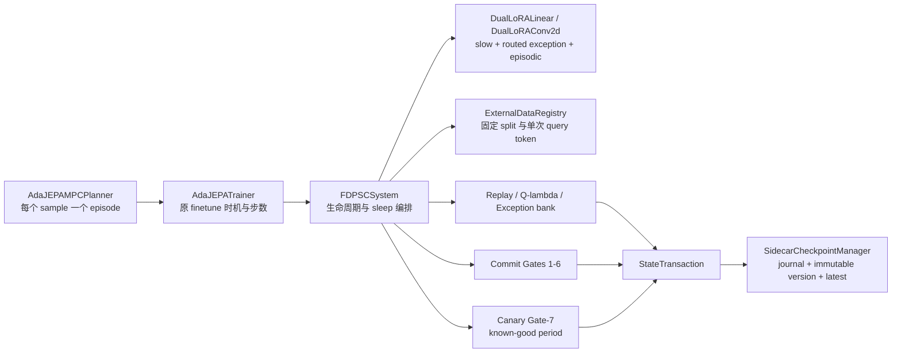
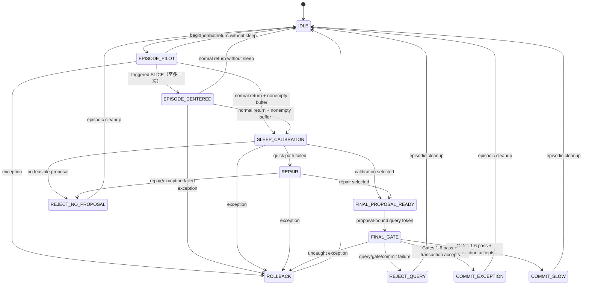
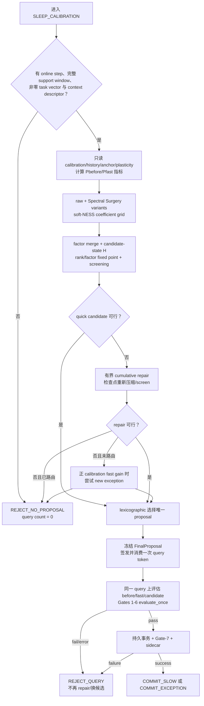

# FD-PSC 设计与实现映射

本文描述当前仓库中的 FD-PSC 实现，而不是一份脱离代码的算法设想。运行与数据准备见[使用指南](fd_psc.md)，原 AdaJEPA 接入点见[仓库审计](fd_psc_audit.md)。核心编排位于 [`fd_psc/trainer.py`](../fd_psc/trainer.py)，状态约束位于 [`fd_psc/state_machine.py`](../fd_psc/state_machine.py)。

## 1. 边界与不变量

- `theta_0` 是已加载的官方 AdaJEPA checkpoint。Linear/Conv2d wrapper 保留原层为冻结子模块；`FDPSCSystem` 保存所有基础 parameter 和 persistent buffer 的逐位快照，并在 online step、sleep、commit、rollback 和恢复后检查。FD-PSC sidecar 从不写回官方 checkpoint。
- 每个 logical layer 的有效参数状态为

  $$P_{before}=\theta_0+\Delta W_{slow}+\Delta W_{route},$$
  $$P_{fast}=P_{before}+\Delta W_{episode},$$
  $$P_{candidate}=\theta_0+\Delta W_{proposed}+\Delta W_{route}.$$

  routed-exception proposal 更新同一 exception；global-slow proposal 不把 routed exception 重复写入 slow。
- support、historical replay、exception-local replay、anchor、calibration、commit-query、plasticity support/query 和 report-test 是不同数据域。support 在第一次在线更新前完成 identity/checksum/leakage 审计；commit-query 只在 calibration 已冻结唯一 proposal 后开放。
- 一个 episode 至多一次 Pilot→Centered、一次 sleep、一个 final proposal、一次 commit-query gate 和一次 persistent commit。query 已消费、gate ledger 和审计指标不因持久状态 rollback 而“退回未使用”。
- slow、exception bank、global replay、activation subspace `Q/lambda`、梯度参考、计数器和 canary-period bookkeeping 在持久提交事务内一致更新或回滚。只有成功 global-slow commit 更新 global replay、`Q/lambda` 和 `successful_slow_commit_count`；exception commit 只更新 exception adapter/prototype/local replay。

## 2. 总体架构



目标发现和注入由 [`fd_psc/injector.py`](../fd_psc/injector.py) 完成：默认覆盖 predictor 活跃 Linear 和 post-backbone projection head 的活跃 Linear/Conv2d，排除 frozen visual backbone。grouped Conv2d 每个 group 是独立 logical layer，独立维护 rank、LoRA、`Q/lambda`、基础谱和 checkpoint 状态；生产前向按 A 卷积再按 B 的 `1x1` 卷积执行，不物化完整卷积核增量。

## 3. 状态机



`FINAL_PROPOSAL_READY` 中的 `FinalProposal` 绑定 `proposal_id`、类型和 candidate payload；`begin_final_gate()` 还要求匹配的 query token。状态机在调用前登记 gate 次数，因此缺失值、非有限值或 evaluator 异常也不能授权第二次 query。显式比较模式 `accumulate`、`episodic_reset`、`plain_svd` 有标注的简化生命周期，不能作为完整 FD-PSC 报告。

## 4. Episode 流程

1. planner 在 `_plan_single()` 前，从 episode-start metadata/manifest 显式解析 context，建立 Pilot，并用 frozen context descriptor 固定本 episode 的 exception route。真实 production match 此时原子推进 router usage/LRU；screening、report-test 和 canary 始终使用 `production=false`，不计使用。不得从 calibration/query 反推 context。
2. 每次 MPC feedback 取得 `T+1` 观测和 `T` 动作；`register_support_segment()` 冻结 episode/context/preprocess/schema 和 trajectory/transition/frame/content identity，并与全部 external split 做四层泄漏审计。
3. 原 `finetune_every`、recent/hard buffer 和 `trainer.steps` 保持不变。online optimizer 只包含 episodic factors；predictor 与 encoder projection 继续使用各自 LR group，基础层保持 eval/frozen。
4. 一次 `finetune()` 有多个 optimizer step 时，每个真实 step 后立即在同一 `P_fast` calibration/history/anchor 状态检查冲突。若第 `j` 步触发 SLICE，Pilot 冻结、Centered 零函数接入；仅当还存在第 `j+1` 个原定 step 时重建同类型 optimizer，使 Centered 从下一真实 step 训练。切换不增加 step。
5. SDC event 状态在一次 `finetune()` 末尾更新一次，`replan_index` 也只加一；因此一次多步 event 内共享进入该 event 时的 SDC active 状态。active SDC 的每一步使用精确 two-pass：第一遍测有效权重梯度，清空 parameter grad、复原 forward RNG，第二遍重算同一 JEPA loss 并加 stop-gradient factor proxy，再执行唯一一次 optimizer step。
6. `_plan_single()` 正常返回且 planner buffer 非空时恰好进入一次 sleep；空 buffer 走 `NO_SLEEP`。任意 planner/online 异常调用 abort，恢复 episode-start adapter/repair 状态，绝不创建 proposal。cleanup 到 `IDLE` 后，非 commit 终态按 `checkpoint.save_every_episodes` 写 auditable episode snapshot（默认每 episode），因此 reject/`NO_SLEEP`/abort 的 episode counter、真实 route usage、query/gate ledger、metrics sequence 与 RNG 都可恢复；它不增加 persistent model commit count。成功 persistent commit 已写入等价的 projected-IDLE transaction checkpoint，不重复保存。

### Support stitching

online recent-buffer merge 保持原实现；长时 replay 的 stitching 是后置、只读流程。单段不足 `num_hist + num_pred` 帧时，只拼接满足以下全部条件的相邻段：同 episode/context/preprocess/schema、同一 trajectory、replan 序号连续、无重复 transition、仅共享一个稳定边界 frame ID、边界所有观测张量逐位相等。拼接后重算 content hash，并再次调用 external registry 审计。identity gap 会丢弃未完成 chain；stable ID 声称连续但 tensor 不同则 fail-closed。达到最小窗口后 chain 被消费，不制造重叠或伪观测。

## 5. Sleep 流程与单 proposal/单 query



未路由 episode 使用 Path A(global slow quick) → B(global repair) → C(new exception)。已路由且配置为 replacement 时，只更新该 exception，并只使用其 local replay；不尝试 global slow 或第二个 exception。rank cap 失败保留最大合法截断作为 repair seed，但 quick path 不能提交它。

screening 只访问 calibration、相关 replay、anchor 和成对 plasticity probes。先剔除 fast-gain retention、history/worst-context、anchor、plasticity、functional error 和 drift 不可行项，再依次按 calibration gain（降序）、context/anchor regression、functional error、总 rank、固定类型/系数顺序确定性排序。`commit_query_used_for_selection` 固定为 false。query 失败或 Gate 1-6 任一 fail 后是本 episode 终态。

## 6. 关键数学公式

### 6.1 Canonical LoRA 与 JEPA loss

LoRA scaling 只吸收一次：`s=alpha/r_actual`，canonical factors 表示 `Delta W=BA`。Pilot 为

$$\Delta W_{pilot}=s_p B_pA_p,$$

Centered 为

$$\Delta W_{center}=s_c(B_cA_c-B_c^0A_c^0).$$

激活瞬间 `(B_c,A_c)=(B_c^0,A_c^0)`，所以输出连续；完整 episodic vector 是 Pilot 与 Centered canonical factors 的拼接。online、repair 和 probe 使用同一 sliding one-step latent MSE：对全部有效 JEPA window 取预测 latent 与 stop-gradient target latent 的均值平方误差。

### 6.2 梯度几何与 Triggered SLICE

有效权重梯度余弦为

$$\rho(G,R)=\frac{\langle G,R\rangle_F}{\|G\|_F\|R\|_F+\epsilon}.$$

history 与 anchor 分别维护 EMA 和连续冲突计数。默认双约束修正求解

$$\min_{\widetilde G}\frac12\|\widetilde G-G_{cur}\|_F^2,$$
$$\langle\widetilde G,G_{hist}\rangle_F\ge-\delta_h,\qquad
  \langle\widetilde G,G_{anchor}\rangle_F\ge-\delta_a,$$

并枚举至多两个约束的 active set。`c_pcgrad` 消融在负内积时应用

$$G\leftarrow G-c\frac{\langle G,R\rangle_F}{\|R\|_F^2+\epsilon}R.$$

对 `G_tilde=U Sigma V^T`，`slice_exact` 在维度和数值方向足够时取 `Bhat=U[:,0:r]`、`Ahat=Vh[r:2r,:]`；否则回退到 `Bhat=U_r sqrt(Sigma_r)`、`Ahat=sqrt(Sigma_r)V_r^T`。两 factor 同乘 `sqrt(beta)`；`beta` 通过真实 optimizer 零状态第一步搜索，使有效 `Delta W` 范数与同层标准 Pilot 基线相差不超过 5%，并要求与 `-G_tilde` 的 cosine 为正。失败就保留 Pilot。

### 6.3 SDC 与谱漂移

基础权重保留达到能量阈值的 `U0,Sigma0,V0`。episodic/persistent 漂移为

$$D(\Delta W)=\frac{\|U_0^T\Delta W V_0\|_F^2}{\|\Delta W\|_F^2+\epsilon}.$$

active SDC 将有效梯度分解为

$$G_p=U_0(U_0^TGV_0)V_0^T,\quad G_r=G-G_p,$$
$$\gamma=\operatorname{clip}\left(\sqrt{\frac{\|G_r\|_F^2}{\|G_p\|_F^2+\|G_r\|_F^2+\epsilon}},\gamma_{min},1\right),$$
$$G'=G-(1-\gamma)G_p.$$

默认 event trigger 要求 drift 信号与安全信号同时成立。每个 scheduled check 使用 manifest 固定的 immutable anchor：`P_before` 是 episode-start 的固定 route 加零 Pilot 状态，第一次 scheduled check 计算并缓存一次；`P_fast` 在每次 scheduled check 重新评估，并令 `anchor_regression=L_anchor(P_fast)-L_anchor(P_before)`。安全信号为 `anchor_regression > anchor_regression_trigger` 或该层 `rho_anchor<0`；二者与 drift 信号共同驱动 `SDCEventTracker`。anchor 评估在 preserve-runtime/RNG 边界内执行，不改变 live adapter state 或随机流。

### 6.4 Spectral Surgery、soft-NESS 与 rank

Spectral Surgery 从 episodic canonical factors 的薄 QR/小矩阵 SVD 得到 `M=U diag(sigma)V^T`，只搜索 `a_i`：

$$M(a)=U\operatorname{diag}(a\odot\sigma)V^T,$$
$$\nabla_{a_i}J_{lin}=\sigma_i[U^TG_{cal}V]_{ii}.$$

当前实现固定这一个 calibration linearized gradient，执行配置步数的 box projection；可选保持 `\|a odot sigma\|_2=\|sigma\|_2`。它只生成候选，且 untruncated operated candidate 若比原 candidate 的 calibration loss 更差会被拒绝。

历史激活 `H in R^{N x d_in}` 的右奇异向量定义输入子空间：

$$H=U_H\Sigma_HV_H^T,\quad Q=V_H[:,0:q],\quad\lambda_i=\sigma_i^2/N,$$
$$p_i=\frac{\lambda_i}{\lambda_i+\tau},\quad P=Q\operatorname{diag}(p)Q^T.$$

`minimum_energy` 与 `lambda/tau` 使用相同协方差能量单位。soft-NESS 右变换为

$$R=\alpha_{safe}I+(\alpha_{shared}-\alpha_{safe})P,$$
$$AR=\alpha_{safe}A+(\alpha_{shared}-\alpha_{safe})(AQ)\operatorname{diag}(p)Q^T,$$

不构造 dense `I/P`。空历史或无有效方向时 `Q` 为空，完整 task vector 进入 safe 分量。

slow/task factors 先拼接，再以两侧薄 QR 和小 core SVD 压缩。每层 rank 候选为 `min(configured_rank, maximum_rank, d_out, d_in)` 的去重集合；仅数值秩为零允许 canonical rank 0。最小可行 rank 同时满足

$$\frac{\sum_{i\le r}\sigma_i^2}{\sum_i\sigma_i^2}\ge\tau_E,$$
$$e_{func}=\frac{\|(M-\widehat M)H^T\|_F^2}{\|MH^T\|_F^2+\epsilon}\le\tau_F.$$

当参考输出近零时另用普通 Frobenius absolute error 与数值容差比较。`H` 在 candidate persistent state 下重采集；rank 与下游 activation 迭代至 factor bitwise fixed point，cycle/不收敛即拒绝。

### 6.5 Repair 与 Gates

repair 是同一条 cumulative optimizer trajectory，在配置检查点克隆 state、重新压缩并完整 screening：

$$L_{repair}=w_cL_{JEPA,current}+w_rL_{JEPA,replay}+w_pL_{LPR}.$$

LPR 缓存 `P_before` 在指定 key layers 的真实输出，candidate 每步重新前向；几何修正作用于有效权重梯度，再用 stop-gradient proxy 传到 factors。历史为空时 replay/LPR 项为 not-applicable，并重新归一化启用权重。

最终 Gates 1-6 依次检查：commit-query fast gain retention、historical mean/worst-context、anchor、成对 plasticity one-event gain、per-layer functional error、per-layer spectral drift increase。plasticity before gain 大于 epsilon 时要求 `G_candidate>=kappa G_before`；否则要求 candidate gain 非负且相对 before 的下降不超过 absolute tolerance。Gate 2 只在第一次成功 slow commit 前可 cold-start N/A；之后 durable `successful_slow_commit_count` 使空/损坏 replay fail。

## 7. 组件开关

| 配置 | 默认 | 当前语义 |
|---|---:|---|
| `enabled` | `true`（default group） | false 时不构造 FD 系统，保留原 snapshot/reset 路径 |
| `run_mode` | `fd_psc` | `episodic_reset`、`accumulate`、`plain_svd` 是显式基线；accumulate 持久对象是完整 live adapter，plain-SVD 的 slow 交换与 sidecar 同事务 |
| `target_modules.*` / `conv_lora.enabled` | predictor/projection on | 控制真实 active target；frozen backbone 永远排除 |
| `gradient_geometry.enabled` | true | effective-gradient hooks、EMA、约束投影；dropout 必须为 0 |
| `slice.enabled` | true | delayed one-shot Pilot→Centered；依赖 gradient geometry/Pilot |
| `sdc.enabled`, `event_triggered` | true, true | event-triggered two-pass；false event 是 always-on 消融 |
| `spectral_surgery.enabled` | true | 仅候选；默认只处理 output-writing layers |
| `activation_subspace.enabled` / `merge.soft_ness_enabled` | true | `Q/lambda` soft-NESS；关闭 soft-NESS 时完整 task、系数 1 |
| `repair.enabled`, `proximal_enabled`, `pcgrad_enabled` | true | bounded cumulative JEPA repair；按项显式消融 |
| `exception.enabled` | true | global/repair 都失败且 calibration fast gain 有效时允许 new exception |
| `gates.*_enabled` | 全 true | 关闭任一 Gate 1-6 必须 `allow_unsafe_ablation=true` |
| `canary.enabled` | false | 有环境 evaluator/manifest 时启用 Gate-7；unavailable 记录 UNRUN，不等同 PASS |
| `checkpoint.enabled` / `save_every_episodes` | true / 1 | 每个 persistent mutation 都写 journal/version；非 commit 终态按 cadence 写 episode snapshot；只支持 between-episode resume |

完整字段、默认值和 fail-fast 组合约束以 [`fd_psc/config.py`](../fd_psc/config.py) 与 [`conf/fd_psc/default.yaml`](../conf/fd_psc/default.yaml) 为准；命名消融以 [`conf/fd_psc/experiments.yaml`](../conf/fd_psc/experiments.yaml) 为准。

## 8. 事务、checkpoint schema 与 canary known-good

### 8.1 Live transaction 边界

`StateTransaction` 在 apply candidate 前深拷贝 adapters、global replay、activation subspaces、exception router（含 prototype/raw sums/count/local replay/usage）、canary-period state、episode/commit/slow-commit counters、history/anchor gradients和 Python/NumPy/Torch CPU/CUDA RNG。异常或未显式 `commit()` 时逆序恢复。production route usage 在 transaction 之前发生，因此是 rollback 后仍保留的 baseline；新 exception 本 episode 原先 slow-only，成功 commit 时在 transaction 内初始化 `usage_count=1` 与 LRU clock；replace 已由 route 计数，commit 不重复加一。repair sampler 在普通 reject/commit failure 的 terminal cleanup 中恢复 episode-start state；canary known-good 另保存 repair state用于跨周期恢复。

`plain_svd` 是独立的简化 commit 路径：先在 factor space 合并旧 slow 与本 episode task并截到固定 rank，再在一个只覆盖其实际可变对象的 `StateTransaction` 中交换 adapters、推进 commit/counter/lifecycle，并在 checkpoint 启用时写 journal、immutable version 和 latest pointer。sidecar 成功返回后才提交 transaction；写入或验证异常会恢复 commit 前 adapter（包括当时 episodic state）、计数器、状态机和 RNG，并保留旧 latest。随后由上层 abort 完成 episode cleanup。checkpoint 被显式关闭时只能得到进程内 slow 更新，不能称为 durable commit。该基线绕过 Gates 1–7、commit-query、bank、global replay 与 `Q/lambda` 更新，因此只能按 unsafe comparison 报告。

external query/gate invocation ledger故意不在回滚边界：已查看的 query 永远保持已消费。`theta_0` 也不属于“可回滚训练参数”，因为它从不允许变化；变化会触发 hard failure。

### 8.2 Sidecar schema v1

```text
immutable envelope
├── schema_version, commit_id, commit_sequence, created_at_ns
├── base_checkpoint_hash, manifest_hash, config_identity
├── state_hash
└── state
    ├── schema_version, config, config_identity, run_mode
    ├── base_checkpoint_hash, preprocess_hash
    ├── target_manifest + target_manifest_hash
    ├── external_manifest_hash, canary_manifest_hash, latent_adapter_schema
    ├── episode_sequence, commit_sequence, lifecycle(projected IDLE counters)
    ├── adapter_slow[logical_id].{B,A}
    ├── accumulate_adapter_state[logical_id].adapter_state  # 仅 accumulate，其他模式为 null
    ├── base_spectra[logical_id].{U,sigma,V,energy_rank,weight_hash}
    ├── activation_subspaces[logical_id].{Q,energies}
    ├── replay (schema 1, clusters/reservoir metadata/RNG)
    ├── exception_router (schema 2; schema 1 explicit compatibility load)
    ├── commit_gates + external_data invocation ledgers
    ├── repair, history_gradients, anchor_gradients
    ├── canary_period.{known_good,pending_commit_ids,last_rollback}
    ├── metrics, diagnostics
    └── RNGSnapshot
```

sidecar 只定义 between-episode 恢复边界。普通 `fd_psc`、`episodic_reset` 和 `plain_svd` 模式在加载 persistent memory 后清空 Pilot/Centered，并在下一 episode 重新建立 fixed route。`accumulate` 是刻意的例外：其跨 episode 记忆本来就位于 live episodic adapter，因此每个到达保存 cadence 的终态 snapshot 同时写入完整 `accumulate_adapter_state`，包括 slow/exception/Pilot/Centered factors、Centered 初值与 adapter enabled/frozen 生命周期字段。加载要求该字段为 mapping、logical registry 精确相同且 finite，然后逐位恢复，清除 active routed exception，并将 episodic parameters 保持 frozen，直到下一次正常 online update；非 accumulate sidecar 的该字段必须为 `null`，出现非 `null` 内容即拒绝。加载还严格匹配 config persistence identity、run mode、base/preprocess/target/external/canary hash 和 latent schema。非 commit 版本使用固定宽度 `snapshot-episode-XXXXXXXX`；若同一 ID 已有 aborted journal，统一 allocator 追加固定宽度 `-attempt-XXXXXXXX`，model commit/rollback 也使用相同的永不复用规则。

写入顺序为：`prepared` journal → fsync 临时 envelope → 重新加载并验证 state/file hash → 原子移动为 immutable `state-*.pt` → 原子更新 latest pointer → journal 标记 `committed`。失败恢复旧 pointer并标 `aborted`。load/recovery 交叉校验 pointer、journal、envelope 的 ID、sequence、state hash、schema、version file 和 file hash；recovery 排序只使用通过全套校验的 envelope sequence。retention 同样只让验证通过的 committed/rolled-back entry 参与排序和删除，损坏 entry 保留审计但不能挤掉有效 fallback。latest 损坏时只扫描 hash 完整且 journal=`committed` 的版本；`rolled_back` 版本保留审计证据但不可恢复。

`prepared`/`aborted` system journal 还是 durability tombstone：episode ID 是 zero-based，而 `episode_sequence=N` 只覆盖 `[0,N)`；若 tombstone 的 episode index `>=N`，resume fail-closed，不能从旧 latest 重开 query。成功的同 episode cleanup snapshot 将 count 推到 `N+1` 后自然解除 tombstone。显式 immutable version 也必须是同目录 recovery 可见的最新有效边界；旧 version 会因 episode/query ledger 回退而被拒绝。

### 8.3 Gate-7 known-good

启用 canary 时，系统在初始/恢复状态建立 known-good；其中包含 canonical persistent adapters、replay、`Q/lambda`、router、gradient references、repair state、RNG 和对应 rollout bundle。高风险 repair/spectral、exception replace 或 rank expansion 可触发 pre-commit canary；post-commit 按 `every_episodes=K` 比较“上一次实际 PASS 的 known-good”与当前累计 candidate。若第 K 个 episode没有 commit，在第一次后续成功 candidate 补跑。

PASS 才提升 known-good并清空 pending commit IDs。UNRUN 记录原因但不提升 known-good。FAIL 恢复整个 known-good algorithm period，保留当前 episode 序号、已消费 query、gate ledger 和 commit-ID 高水位；随后写 `rollback-XXXXXXXX` immutable sidecar，把被撤销 journals 标为 `rolled_back`。

## 9. Failure handling

| 故障 | 结果 | 持久状态/query |
|---|---|---|
| 配置、target、base/preprocess/manifest/hash 不匹配 | 启动 fail-fast | 未开始 episode |
| support identity/leakage/边界伪造 | 抛错并 abort | episode adapter 恢复；不 sleep/query |
| 无 online step、无完整 stitching window、context descriptor 缺失、task 近零 | `REJECT_NO_PROPOSAL` | query=0；不更新 slow/exception/replay/Q |
| rank/数学非有限、candidate fixed point cycle、screening 不可行 | 该 candidate 拒绝 | 可在 calibration 阶段 repair/exception；仍不读 query |
| 首次 slow commit 后 history 为空/损坏 | proposal 前拒绝 | 不把它重新当 cold start |
| commit-query 读取失败或 Gates 1-6 fail | `REJECT_QUERY` | token 保持已消费；禁止第二 proposal |
| pre-commit canary fail、apply/update/checkpoint 失败 | transaction rollback、终态 reject | slow/exception/replay/Q/router/counters/RNG 恢复；query 不恢复 |
| `plain_svd` sidecar 写入/验证失败 | plain-SVD transaction 未提交并抛错，上层 abort | adapter、commit counters、lifecycle、RNG 回到 slow 交换前；旧 latest 不变 |
| `accumulate` episode snapshot 写失败 | live accumulate adapter 保留、显式报错 | 不伪造 rollback；旧 latest 仍是较早 adapter，tombstone 阻止从该过期边界 resume |
| 非 commit episode snapshot 写失败 | cleanup 保持 `IDLE`、旧 latest 仍有效并显式报错 | 不回滚真实 route/query；prepared/aborted tombstone 阻止旧边界 resume，重试使用新 attempt ID |
| periodic post-commit canary fail | 跨周期恢复 known-good并写 rollback sidecar | pending commits 全部失效；审计 ID/ledger 单调 |
| canary evaluator 不可用 | `UNRUN` + limitation | 不伪装成 PASS；是否允许继续由已验证 policy 决定 |
| `_plan_single()`/online/sleep 未捕获异常 | `ROLLBACK -> IDLE` 后重抛 | 不生成替代 proposal |
| `theta_0` parameter/buffer 变化 | hard failure | 事务/episode rollback；不得容忍或重新基线化 |

## 10. 论文方法与代码模块对应

| 方法/论文术语 | 当前代码 |
|---|---|
| full-depth Linear/ConvLoRA、Pilot/Centered/slow | [`lora_layers.py`](../fd_psc/lora_layers.py), [`injector.py`](../fd_psc/injector.py) |
| MPC episode 与原 update schedule | [`planning/adajepa_mpc.py`](../planning/adajepa_mpc.py), [`planning/adajepa.py`](../planning/adajepa.py) |
| 显式 lifecycle、single proposal/query | [`state_machine.py`](../fd_psc/state_machine.py), [`trainer.py`](../fd_psc/trainer.py) |
| exact effective-weight gradients、cosine/PCGrad/dual projection | [`gradient_hooks.py`](../fd_psc/gradient_hooks.py), [`gradient_geometry.py`](../fd_psc/gradient_geometry.py) |
| Triggered Delayed SLICE 与 first-step matching | [`slice_initializer.py`](../fd_psc/slice_initializer.py) |
| SDC-LoRA、base spectrum、spectral drift/Surgery | [`spectral_control.py`](../fd_psc/spectral_control.py) |
| activation `Q/lambda` 与 soft-NESS | [`activation_subspace.py`](../fd_psc/activation_subspace.py) |
| factor-only merge、small-core SVD、rank/functional error | [`low_rank_merge.py`](../fd_psc/low_rank_merge.py) |
| balanced historical replay 与 support provenance | [`replay_memory.py`](../fd_psc/replay_memory.py), [`trainer.py`](../fd_psc/trainer.py) |
| cumulative JEPA/LPR repair、GRASP schedule | [`repair.py`](../fd_psc/repair.py), [`trainer.py`](../fd_psc/trainer.py) |
| context router、exception prototype/local replay | [`exception_router.py`](../fd_psc/exception_router.py) |
| Gates 1-6 与 one-invocation ledger | [`commit_gates.py`](../fd_psc/commit_gates.py) |
| fixed external splits、token、leakage audit | [`external_data.py`](../fd_psc/external_data.py), [`preprocess_identity.py`](../fd_psc/preprocess_identity.py) |
| atomic transaction/sidecar/recovery | [`transaction.py`](../fd_psc/transaction.py), [`checkpoint.py`](../fd_psc/checkpoint.py) |
| Gate-7 paired rollout 与 known-good scheduler | [`canary.py`](../fd_psc/canary.py), [`trainer.py`](../fd_psc/trainer.py) |
| metrics、candidate/experiment report | [`metrics.py`](../fd_psc/metrics.py), [`experiment_reporting.py`](../fd_psc/experiment_reporting.py) |

当前实现保证的是 between-episode resume；没有可序列化环境与 planner action warm start 时，不宣称真实 rollout 的精确 mid-episode resume。真实 planning success 只能来自实际 rollout，calibration/query JEPA gain、gate pass 或 canary UNRUN 都不能替代。
